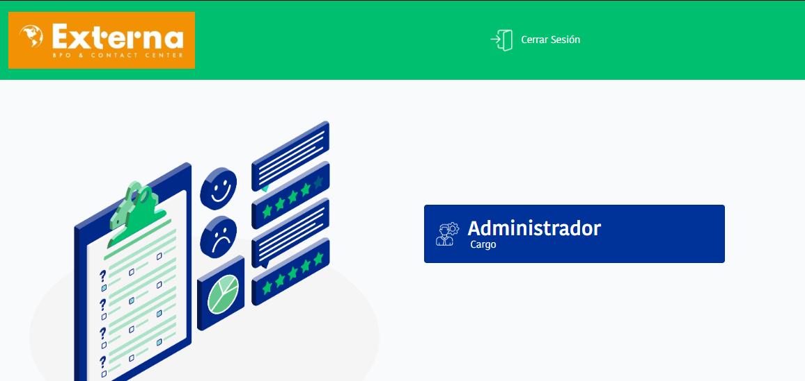
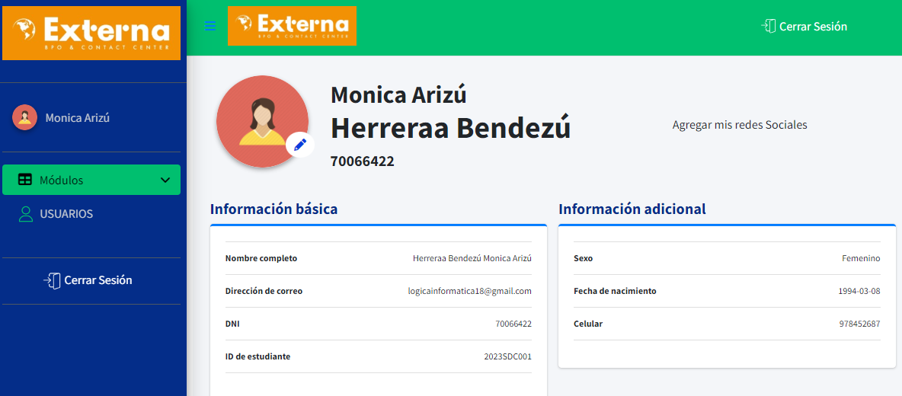
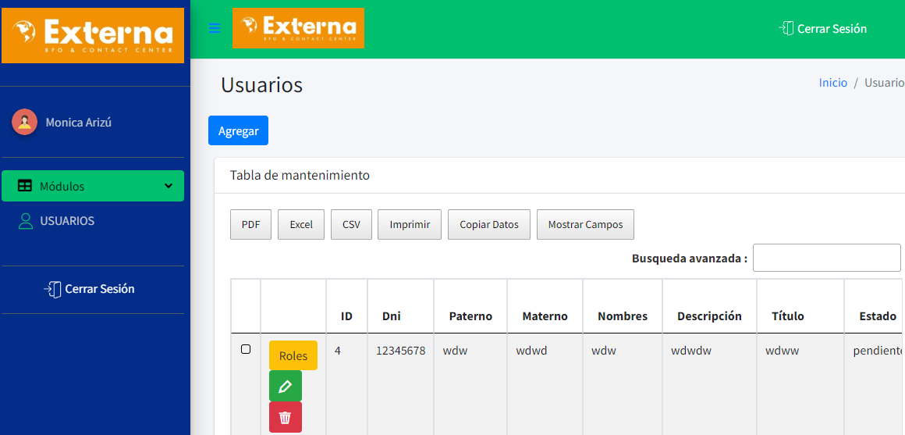
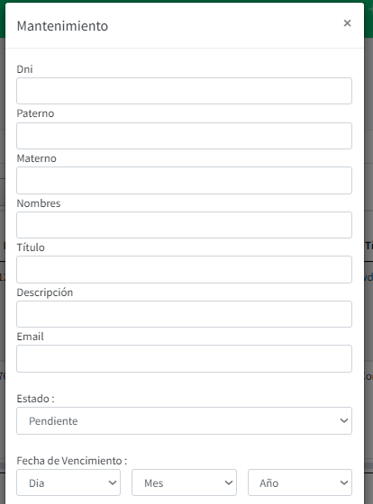

**PRUEBA TÉCNICA EXTERNA**

Este proyecto es una prueba técnica donde se aplica un CRUD en Laravel v. 10.

### **Instalación**

- CLONAR EL PROYECTO.

`git clone  https://github.com/Logicainformatica18/prueba_externa`

- INSTALACIÓN LOCAL
  `composer update`
- CAMBIA EL NOMBRE DEL ARCHIVO DE .env.example a .env Y LUEGO EJECUTA
  `php artisan key:generate`
- CREA UNA BASE DE DATOS CON EL NOMBRE: tareas

- CONFIGURAR LA CONEXIÓN A LA BASE DE DATOS

`DB_CONNECTION=mysql`
`DB_HOST=127.0.0.1`
`DB_PORT=3306`
`DB_DATABASE=tareas`
`DB_USERNAME=root`
`DB_PASSWORD=`

- EJECUTA EL SIGUIENTE COMANDO PARA CREAR LAS TABLAS EN LA BASE DE DATOS
  `php artisan migrate`

- LUEGO PARA ALMACENAR REGISTROS
`php artisan db:seed`

 ### **EJECUCIÓN DEL PROYECTO**
 - Inicia sesión con el siguiente usuario : logicainformatica18@gmail.com  password: 12345678

- Da un clic en el tipo de usuario **ADMINISTRADOR**

- Una vez en el tablero dar clic en **USUARIOS**

- Puedes dar un clic en:  **Agregar** para crear usuario, en el boton rojo para eliminar, en el botón verde para empezar a editar.

 ### **INSTALACIÓN REMOTA**
- Si estas trabajando con hostinguer es necesario usar Composer2.

  `composer2 update`
### **Contribución**
`Puedes realizar tus aportes. `
### ** - **
`. `